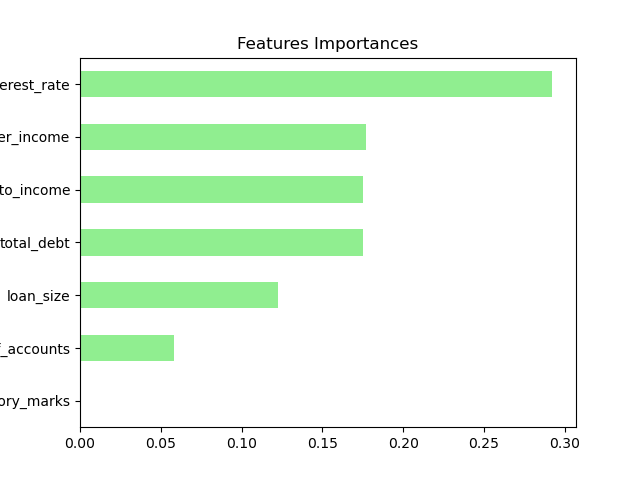

# Credit Risk Analysis Report

## Analysis overview
Using logistic regresion and random forest classifier, we are building a model to evaluate the creditworthiness of borrowers based on thie historical lending activity data.

## Results
1. Logistic regression model

       Confusion Matrix results
           True positive:  18679   
           False positive: 67
           True negative:  558
           False negative: 80

                     precision    recall  f1-score   support

                  0       1.00      1.00      1.00     18759
                  1       0.87      0.89      0.88       625

           accuracy                           0.99     19384
          macro avg       0.94      0.94      0.94     19384
       weighted avg       0.99      0.99      0.99     19384

##Discussion: 
For the logistic regression model, the recall for healthy "0" loans is 100%, while for risky loan is 89%. From confusion matrix, 67 were tagged as false positive while 80 were tagged as false negatives. 

2. Random Forest Classifier

       Confusion Matrix results
           True positive:  18681   
           False positive: 74
           True negative:  551
           False negative: 78

                     precision    recall  f1-score   support

                  0       1.00      1.00      1.00     18759
                  1       0.88      0.88      0.88       625

           accuracy                           0.99     19384
          macro avg       0.94      0.94      0.94     19384
       weighted avg       0.99      0.99      0.99     19384

##Discussion: 
For the random forest classifier model, the recall for healthy "0" loans is 100%, while for risky loan is 88%. From confusion matrix, 74 were tagged as false positive while 78 were tagged as false negatives. 

As the ratio of healthy to risky loan is 30:1, both models can better predict the healthy loans than risky loans.

3. Feature importance

 Looking at the each feature importance, the "derogatory marks" (borrower specific feature) is not relevant for this model. The interest rate is highly relevant in determining the default risk to the borrowers. Future data gathering can focus more on other relevant features (borrower income, det to income, total debt and loan size) instead.

 ## Summary
 These 2 models were performed and compared to see if 2 different models yield the same outcome. Both models 100% accurate in predicting the healthy loans. Although both models predicted 74 & 78 false positive "healthy loans", these are still 0.03% of the test data, hence a small percentage. Also, with the feature importance, we can see which feature heavily affects the credit score (interest rate), and which feature is less relevant (derogatory marks).

 ## References
[Data](Resources/lending_data.csv) for this dataset was generated by edX Boot Camps LLC, and is intended for educational purposes only.
